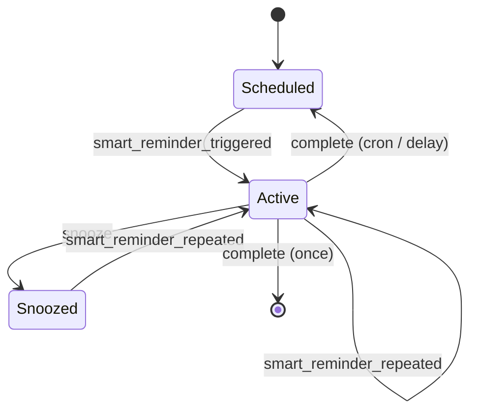

> 🇷🇺 [Русская версия документации](README_RU.md)

# Smart Reminder for Home Assistant

[](https://www.home-assistant.io/)
[](https://hacs.xyz/)
[](LICENSE)

**Smart Reminder** is a local custom integration for Home Assistant that adds
managed reminders with completion acknowledgements, repeated notifications,
snoozing, Do Not Disturb support, and a full management page in the sidebar.

The integration **does not send messages by itself**. It maintains a reliable
schedule and fires events containing ready-to-use text, recipients, and button
parameters. You choose how to deliver them: Telegram, the Home Assistant mobile
app, a smart speaker, Mattermost, or any other Home Assistant automation.

## Features

- Create, edit, duplicate, enable, delete, snooze, and complete reminders from
  a dedicated responsive Home Assistant page.
- Three schedule types: one-time, cron, and delay after actual completion.
- Repeated events at a configured interval until the reminder is completed.
- Separate text fields for the first, repeated, snoozed, and completed events,
  with predictable fallback rules.
- Global DnD window (`23:00–10:00` by default) with a per-reminder override.
- Exact “every N weeks” schedules through the `@every Nw <crontab>` extension.
- Configuration and runtime state persistence using the native HA `Store`.
- Processing of overdue reminders after Home Assistant starts.
- Separate sensor, switch, and button entities for every reminder.
- Actions and events for automations, with no external cloud dependency.
- English and Russian localization for the config and options flows.

## Compatibility

- Home Assistant Core `2026.7.0` and newer releases in the `2026.7` branch.
- Current tested patch release: `2026.7.2`.
- HACS installation is recommended; manual installation is also supported.

## Installation

### HACS (recommended)

The repository includes `hacs.json` and is prepared as a HACS Integration.
Until the project is included in the default HACS catalog, add it as a custom
repository:

1. Open **HACS → Integrations**.
2. Select **Custom repositories** from the menu.
3. Enter the URL of this GitHub repository and choose **Integration** as the
   category.
4. Find **Smart Reminder**, install the latest version, and restart Home
   Assistant.

### Manual installation

1. Copy `custom_components/smart_reminder` into your Home Assistant
   configuration directory:

   ```text
   /config/custom_components/smart_reminder
   ```

2. Restart Home Assistant.

No `configuration.yaml` entry is required.

## Initial setup

1. Go to **Settings → Devices & services → Add integration**.
2. Find **Smart Reminder**.
3. Confirm the DnD window. Times are interpreted in the Home Assistant time
   zone.
4. After setup, the **Smart Reminders** page appears in the sidebar.

To change global settings later, open the integration card and select
**Configure**.

| Global setting | Default value |
|---|---|
| DnD starts | `23:00` |
| DnD ends | `10:00` |
| Error text for an already snoozed reminder | `⚠️ Ошибка. Напоминание уже отложено` |
| Error text for an already completed reminder | `⚠️ Ошибка. Напоминание уже завершено` |

The two Russian strings above are the integration's literal built-in defaults;
you can replace them with English or any other text in the integration options.

If the DnD start and end times are equal, quiet hours are disabled. Empty error
texts are automatically replaced with their defaults.

## Reminder fields

| Field | Description |
|---|---|
| ID | Stable ID up to 64 characters. Latin letters, digits, `.`, `_`, and `-` are allowed. This keeps IDs safe for Telegram callback commands. |
| Name | Human-readable name displayed in the UI and entities. |
| Enabled | A disabled reminder remains stored but does not fire. Re-enabling an overdue reminder processes it immediately, subject to DnD. |
| Type | `once`, `cron`, or `after_completion`. |
| First trigger date and time | Shown when creating `once` and `after_completion` reminders, in the HA time zone. Format: `DD.MM.YYYY`, `HH:MM` (24-hour clock). |
| Next trigger date and time | Shown and editable for every existing reminder type. Format: `DD.MM.YYYY`, `HH:MM` (24-hour clock). |
| Crontab | Standard five-field crontab expression. |
| Anchor date | Optional first cycle date for an `@every Nw` schedule. Selects the week phase, for example `27.07.2026`, and must match the base cron day. |
| Delay after completion | Number of minutes before the next `after_completion` trigger. |
| Ignore DnD | Allows this reminder to fire during quiet hours. |
| Repeat interval | Minutes between repeated events until completion. |
| Default snooze | Included in events both as minutes and as a compact string such as `1h30m` for bot buttons. |
| First text | Used by `smart_reminder_triggered`. |
| Repeated text | Used by `smart_reminder_repeated`; falls back to the first text when empty. |
| Snoozed text | Sent in `smart_reminder_snoozed` immediately after the Snooze action. It is not used by `smart_reminder_repeated`. |
| Completed text | Sent in `smart_reminder_completed`; may be empty. |
| Recipient IDs | Arbitrary strings interpreted by the delivery automation, for example as Telegram chat IDs. |

### Schedule types

| Type | Behavior after completion |
|---|---|
| One-time | The reminder and its entities are deleted. |
| Cron | The nearest next cron occurrence is calculated. |
| Delay after completion | Next trigger = actual completion time + configured delay in minutes. |

Standard crontab cannot express “every two weeks.” Smart Reminder provides a
backward-compatible extension:

```text
@every 2w 0 10 * * 1
```

This starts with “every Monday at 10:00” but uses only every second week. The
**Anchor date** selects the schedule phase: with `27.07.2026` as the anchor,
occurrences are `27.07`, `10.08`, `24.08`, and so on. When the field is empty,
the nearest occurrence becomes the anchor automatically. The anchor is stored
with the reminder, so the phase survives restarts and respects DST in the Home
Assistant time zone.

### Two real-world examples

**Water a cactus every two weeks on Monday at 10:00:**

- type: **Cron**;
- cron: `@every 2w 0 10 * * 1`;
- anchor date: `27.07.2026`;
- repeat interval: for example, `60` minutes.

**Replace the cat's water one day after it was last replaced:**

- type: **Delay after completion**;
- date and time: the first trigger;
- delay: `1440` minutes.

## Lifecycle



DnD does not discard an event: the nearest trigger is moved to the end of the
quiet period. After an outage, HA processes each overdue reminder once after
`Home Assistant started`. Missed repetitions of the same reminder are
coalesced to avoid a notification storm.

## Home Assistant entities

Four entities are created dynamically for every reminder:

| Platform | Name | Purpose |
|---|---|---|
| `sensor` | `<name> status` | State is `scheduled`, `active`, or `snoozed`; attributes include the ID, type, next trigger, cron anchor, recipients, and intervals. |
| `switch` | `<name> enabled` | Enables or disables the reminder. |
| `button` | `<name> snooze` | Snoozes for the default duration. |
| `button` | `<name> complete` | Completes the reminder. |

All entities belong to the virtual **Smart Reminder** device. Home Assistant
generates each `entity_id` from the name, so select entities through the UI or
use the stable `reminder_id` attribute in automations.

## Events

| Event type | When it is fired |
|---|---|
| `smart_reminder_triggered` | First trigger; the status is already `active`. |
| `smart_reminder_repeated` | Repetition before completion or trigger after snooze. `text` always comes from the repeated text field and falls back to the first text when empty. |
| `smart_reminder_snoozed` | Result of a Snooze attempt. On success, `text` contains the configured snoozed text; a repeated Snooze returns the global error text. |
| `smart_reminder_completed` | Result of a Complete attempt. It is also fired for a one-time reminder after that reminder has been removed. Recurring reminders already contain their calculated next trigger. A repeated Complete returns the global error text. |

Core event data contract:

```yaml
reminder_id: take_out_trash
name: Take out the trash
reminder_type: once
status: active
text: Take out the trash
recipient_ids:
  - "<telegram_chat_id>"
ignore_dnd: false
default_snooze_minutes: 90
default_snooze_duration: 1h30m
repeat_count: 0
occurred_at: "2026-07-14T19:00:00+00:00"
scheduled_for: "2026-07-14T19:00:00+00:00"
next_trigger: "2026-07-14T19:15:00+00:00"
cron_anchor: null
```

The `next_trigger` field is always present in `smart_reminder_snoozed` and
`smart_reminder_completed`. It contains the next trigger as an ISO 8601 value,
or `null` after a one-time reminder has been completed and deleted. Both events
also include `action_succeeded` (`true`/`false`) and `reason`, which is
`already_snoozed`, `already_completed`, or `null`. The
`smart_reminder_snoozed` event additionally includes `duration` and
`snoozed_until`.

Format `next_trigger` in the Home Assistant time zone as `DD.MM.YYYY HH:MM`:

```yaml
formatted_next_trigger: >-
  
  {{ as_timestamp(value) | timestamp_custom('%d.%m.%Y %H:%M', true)
     if value else 'No next trigger' }}
```

In HA templates, `%M` means minutes (equivalent to `ii` in some other date
format syntaxes).

The `text` field in `smart_reminder_snoozed` and `smart_reminder_completed` may
be an empty string, but the events are still fired. This lets an automation
provide a default template. A repeated Snooze or Complete always includes the
non-empty global error text. Repeated actions do not change the status,
`next_trigger`, or schedule.

`smart_reminder_snoozed` is fired immediately when the Snooze action is called.
When the delay expires, the scheduler fires `smart_reminder_repeated`, uses the
repeated text, and changes the reminder from `snoozed` to `active`.

## Management page

The **Duplicate** button opens a creation form prefilled from the selected
reminder. A new ID is generated, and the original reminder's runtime state is
not copied. For `once` and `after_completion`, the original reminder's nearest
trigger becomes the copy's first trigger. Saving creates a separate reminder
without changing the original.

## Actions

### `smart_reminder.create`

Creates a simplified one-time reminder. `reminder_id` and `name` are optional.
When the action is called with `response_variable`, it returns the generated ID.

```yaml
action: smart_reminder.create
data:
  reminder_id: take_out_trash
  name: Take out the trash
  at: "2026-07-14 22:00:00"
  text: Take out the trash
  recipient_ids:
    - "<telegram_chat_id>"
  ignore_dnd: false
  repeat_interval_minutes: 15
  default_snooze_minutes: 90
response_variable: created_reminder
```

### `smart_reminder.snooze`

The duration is a compact combination of days, hours, and minutes without
spaces: `15m`, `1h30m`, or `2d3h15m`.

```yaml
action: smart_reminder.snooze
data:
  reminder_id: take_out_trash
  duration: 1h30m
```

If the reminder is already `snoozed`, another action does not move it again and
fires `smart_reminder_snoozed` with `action_succeeded: false`.

### `smart_reminder.complete`

```yaml
action: smart_reminder.complete
data:
  reminder_id: take_out_trash
```

If a recurring reminder has already been completed and its next cycle is
scheduled, another action does not recalculate the trigger. Instead, it fires
`smart_reminder_completed` with `action_succeeded: false`. A one-time reminder
is deleted after successful completion, so calling the action again returns a
“not found” error and cannot fire a second event.

## Complete Telegram Bot example

The examples target the current UI-based
[Telegram bot](https://www.home-assistant.io/integrations/telegram_bot)
integration in HA 2026.7. It exposes commands and callback buttons through an
event entity. Replace `event.my_telegram_bot` with your bot's event entity in
every example. If you have multiple bots, add `config_entry_id` to the
`telegram_bot.*` actions.

### 1. Handle Smart Reminder events

This automation delivers first and repeated reminders with inline buttons, as
well as completion and snooze confirmations. It interprets `recipient_ids` as
Telegram chat IDs.

```yaml
alias: Smart Reminder. Handle application events
triggers:
  - trigger: event
    event_type: smart_reminder_triggered
    id: triggered
  - trigger: event
    event_type: smart_reminder_repeated
    id: repeated
  - trigger: event
    event_type: smart_reminder_completed
    id: completed
  - trigger: event
    event_type: smart_reminder_snoozed
    id: snoozed
conditions:
  - condition: template
    value_template: >-
      {{ trigger.event.data.recipient_ids
         | default([], true)
         | count > 0 }}
actions:
  - variables:
      reminder: "{{ trigger.event.data }}"
  - choose:
      - conditions:
          - condition: template
            value_template: "{{ trigger.id in ['triggered', 'repeated'] }}"
        sequence:
          - action: telegram_bot.send_message
            data:
              chat_id: "{{ reminder.recipient_ids | map('int') | list }}"
              parse_mode: plain_text
              message: "{{ reminder.text }}"
              inline_keyboard:
                - >-
                  ✅ Done:/reminder_done:{{ reminder.reminder_id }},
                  🔕 Snooze:/reminder_snooze:{{ reminder.reminder_id }}:{{
                  reminder.default_snooze_duration }}
      - conditions:
          - condition: template
            value_template: "{{ trigger.id == 'completed' }}"
        sequence:
          - variables:
              completed_text: >-
                {{ reminder.text | default('') | string | trim }}
              formatted_next_trigger: >-
                
                {{ as_timestamp(value)
                   | timestamp_custom('%d.%m.%Y %H:%M', true)
                   if value else 'No next trigger' }}
          - action: telegram_bot.send_message
            data:
              chat_id: "{{ reminder.recipient_ids | map('int') | list }}"
              parse_mode: plain_text
              message: >-
                {{ completed_text
                   if completed_text
                   else '✅ Reminder completed' }}.
                Next trigger: {{ formatted_next_trigger }}
      - conditions:
          - condition: template
            value_template: "{{ trigger.id == 'snoozed' }}"
        sequence:
          - variables:
              snoozed_text: >-
                {{ reminder.text | default('') | string | trim }}
              formatted_next_trigger: >-
                
                {{ as_timestamp(value)
                   | timestamp_custom('%d.%m.%Y %H:%M', true)
                   if value else 'No next trigger' }}
          - action: telegram_bot.send_message
            data:
              chat_id: "{{ reminder.recipient_ids | map('int') | list }}"
              parse_mode: plain_text
              message: >-
                {{ snoozed_text
                   if snoozed_text
                   else '🔕 Reminder snoozed' }}.
                Next trigger: {{ formatted_next_trigger }}
mode: queued
max: 20
```

### 2. Handle Telegram inline buttons

Callback data uses `:` as a separator and matches the commands generated by the
first automation.

```yaml
alias: Smart Reminder. Handle Telegram buttons
description: ""
triggers:
  - trigger: state
    entity_id:
      - event.my_telegram_bot
conditions:
  - condition: template
    value_template: >-
      
      
      {{ event_type == 'telegram_callback'
         and (data.startswith('/reminder_done:')
              or data.startswith('/reminder_snooze:')) }}
actions:
  - variables:
      callback:
        id: >-
          {{ trigger.to_state.attributes.id
             | default('', true)
             | string }}
        data: >-
          {{ trigger.to_state.attributes.data
             | default('', true)
             | string
             | trim }}
  - variables:
      callback_parts: "{{ callback.data.split(':', 2) }}"
  - variables:
      command: >-
        {{ callback_parts[0]
           if callback_parts | count > 0
           else '' }}
      reminder_id: >-
        {{ callback_parts[1] | trim
           if callback_parts | count > 1
           else '' }}
      duration: >-
        {{ callback_parts[2] | trim
           if callback_parts | count > 2
           else '' }}
  - choose:
      - conditions:
          - condition: template
            value_template: >-
              {{ command == '/reminder_done' and reminder_id != '' }}
        sequence:
          - action: smart_reminder.complete
            data:
              reminder_id: "{{ reminder_id }}"
          - action: telegram_bot.answer_callback_query
            data:
              callback_query_id: "{{ callback.id }}"
              message: ✅ Reminder completed
              show_alert: false
      - conditions:
          - condition: template
            value_template: >-
              {{ command == '/reminder_snooze'
                 and reminder_id != ''
                 and duration != '' }}
        sequence:
          - action: smart_reminder.snooze
            data:
              reminder_id: "{{ reminder_id }}"
              duration: "{{ duration }}"
          - action: telegram_bot.answer_callback_query
            data:
              callback_query_id: "{{ callback.id }}"
              message: "🔕 Snoozed for {{ duration }}"
              show_alert: false
    default:
      - action: telegram_bot.answer_callback_query
        data:
          callback_query_id: "{{ callback.id }}"
          message: ⚠️ Invalid button data
          show_alert: true
mode: parallel
max: 20
```

### 3. Add a reminder with `/reminder_add`

Both formats are supported. If the date is omitted, the current date in the
Home Assistant time zone is used.

```text
/reminder_add 14.07.2026 22:00 Take out the trash
/reminder_add 22:00 Take out the trash
```

```yaml
alias: Telegram Commands. Add reminder
description: ""
triggers:
  - trigger: state
    entity_id:
      - event.my_telegram_bot
conditions:
  - condition: state
    entity_id: event.my_telegram_bot
    state:
      - telegram_command
    attribute: event_type
  - condition: state
    entity_id: event.my_telegram_bot
    attribute: command
    state: /reminder_add
actions:
  - variables:
      raw_args: >-
        {{ trigger.to_state.attributes.args | default([], true) }}
  - variables:
      tokens: >-
        {{ raw_args.strip().split()
           if raw_args is string
           else (raw_args | list) }}
  - variables:
      has_date: >-
        {{ tokens | count > 0
           and (tokens[0]
                | regex_match(
                    '^[0-9]{2}[.][0-9]{2}[.][0-9]{4}$')) }}
  - variables:
      date_token: >-
        {{ tokens[0] if has_date else now().strftime('%d.%m.%Y') }}
      time_token: >-
        
          {{ tokens[1] }}
        
          {{ tokens[0] }}
        
          {{ '' }}
        
      text_tokens: >-
        {{ tokens[2:] if has_date else tokens[1:] }}
  - variables:
      reminder_text: "{{ text_tokens | join(' ') | trim }}"
      reminder_at: >-
        {% set parsed = strptime(
          date_token ~ ' ' ~ time_token,
          '%d.%m.%Y %H:%M',
          none) %}
        {{ parsed.strftime('%Y-%m-%dT%H:%M:%S')
           if parsed is not none
           else '' }}
  - variables:
      valid_input: >-
        {{ (date_token
             | regex_match(
                 '^[0-9]{2}[.][0-9]{2}[.][0-9]{4}$'))
           and (time_token
                | regex_match(
                    '^(?:[01][0-9]|2[0-3]):[0-5][0-9]$'))
           and reminder_at != ''
           and reminder_text != '' }}
  - choose:
      - conditions:
          - condition: template
            value_template: "{{ valid_input }}"
        sequence:
          - action: smart_reminder.create
            data:
              at: "{{ reminder_at }}"
              name: "{{ reminder_text }}"
              text: "{{ reminder_text }}"
              recipient_ids:
                - "{{ trigger.to_state.attributes.chat_id }}"
              repeat_interval_minutes: 15
              default_snooze_minutes: 30
            response_variable: created_reminder
          - action: telegram_bot.send_message
            data:
              chat_id: "{{ trigger.to_state.attributes.chat_id }}"
              parse_mode: plain_text
              message: |-
                🔔 Reminder created for {{ date_token }} at {{ time_token }}.
                ID: {{ created_reminder.reminder_id }}
    default:
      - action: telegram_bot.send_message
        data:
          chat_id: "{{ trigger.to_state.attributes.chat_id }}"
          parse_mode: plain_text
          message: |-
            ⚠️ Could not create the reminder.

            Use one of these formats:
            /reminder_add DD.MM.YYYY HH:MM text
            /reminder_add HH:MM text

            Examples:
            /reminder_add 14.07.2026 22:00 Take out the trash
            /reminder_add 22:00 Take out the trash
mode: queued
max: 5
```

Telegram limits callback data to 64 bytes. Use short ASCII reminder IDs when
creating them manually.

## Storage and reliability

Data is saved after every change in `.storage` using the native
`homeassistant.helpers.storage.Store`. Do not edit the file manually. Stored
data includes both configuration and runtime state: status, next trigger, last
activation, last completion, and the multi-week cron anchor.

An event is fired only after the new state has been saved. An automation that
immediately reads a sensor therefore sees the current `active`, `snoozed`, or
next scheduled state. The exception is a completed one-time reminder: it and
its entities are deleted, while all required values remain in the
`smart_reminder_completed` event payload.

## Security

- The management page and mutating WebSocket commands require an HA
  administrator.
- The integration exposes no external endpoints and makes no network requests.
- Recipient IDs are treated as opaque strings and are only copied into events.
- Text is escaped before it is rendered in the management table.

## Development

Home Assistant 2026.7 targets Python 3.14. Local checks:

```bash
python3.14 -m pip install -r requirements_test.txt
ruff check .
ruff format --check .
pytest
```

CI also runs HACS validation. The backend is fully asynchronous and uses only
one nearest-point timer for the complete set of reminders.

## Troubleshooting

- **The page did not appear:** make sure the integration is both installed and
  added under **Settings → Devices & services**, then refresh the browser.
- **A reminder did not fire at night:** check DnD and the reminder's
  **Ignore DnD** option.
- **Telegram receives no event:** listen for `smart_reminder_triggered` in
  Developer Tools and verify `recipient_ids`.
- **Cron fires at the wrong time:** cron is evaluated in the time zone selected
  in Home Assistant global settings. For `@every Nw`, also verify the anchor
  date, which controls the multi-week phase.
- **Only one message arrived after an outage:** missed repetitions of the same
  reminder are intentionally coalesced into one current event.

## License

[MIT](LICENSE)
