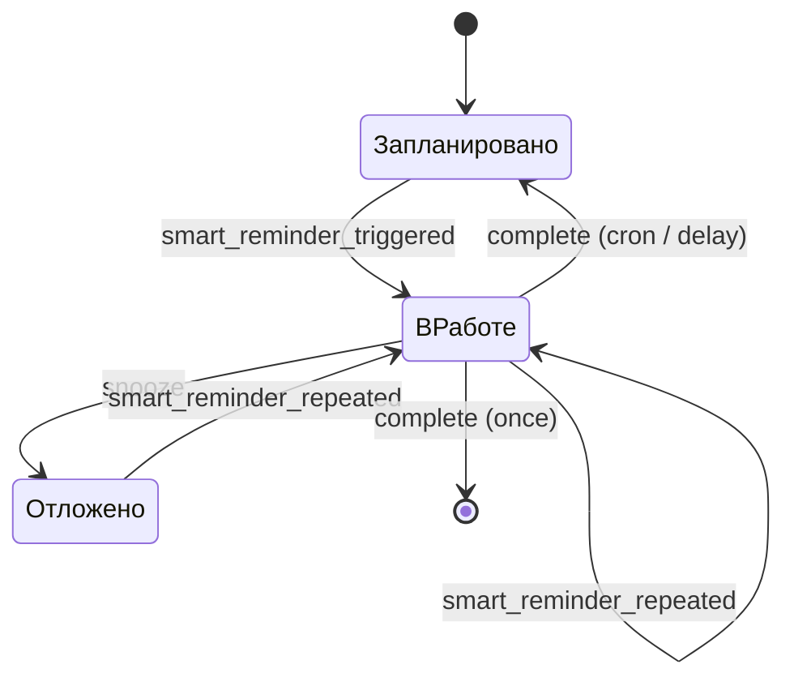

# Smart Reminder for Home Assistant

[](https://www.home-assistant.io/)
[](https://hacs.xyz/)
[](LICENSE)

**Smart Reminder** — локальная Custom Integration для Home Assistant, которая
добавляет управляемые напоминания с подтверждением выполнения, повторами,
мьютом, DnD и полноценной страницей в боковом меню.

Интеграция **не отправляет сообщения сама**. Она отвечает за надёжное
расписание и публикует события с готовыми текстом, получателями и параметрами
кнопок. Способ доставки выбираете вы: Telegram, мобильное приложение,
колонка, Mattermost или любая другая автоматизация Home Assistant.

## Возможности

- Создание, редактирование, включение, удаление, перенос и завершение
  напоминаний из отдельной адаптивной страницы HA.
- Три режима: однократный, cron и задержка после фактического выполнения.
- Повторное событие через заданный интервал, пока напоминание не выполнено.
- Отдельные тексты для первого, повторного, отложенного и выполненного
  напоминания с предсказуемыми fallback-правилами.
- Глобальный DnD (по умолчанию `23:00–10:00`) и индивидуальный флаг его
  игнорирования.
- Точное расписание «раз в N недель» через расширение cron
  `@every Nw <crontab>`.
- Сохранение конфигурации и runtime-состояния в штатном HA `Store`.
- Обработка просроченных напоминаний после запуска Home Assistant.
- Отдельные sensor, switch и button-сущности для каждого напоминания.
- Actions и события для автоматизаций; внешних облачных сервисов нет.
- Русская и английская локализация config/options flow.

## Совместимость

- Home Assistant Core `2026.7.0` и новее в ветке `2026.7`.
- Текущая проверенная patch-версия: `2026.7.2`.
- Установка через HACS рекомендуется, ручная установка также поддерживается.

## Установка

### HACS (рекомендуется)

Репозиторий уже содержит `hacs.json` и подготовлен как HACS Integration.
До включения проекта в стандартный каталог HACS добавьте его как пользовательский:

1. Откройте **HACS → Integrations**.
2. В меню выберите **Custom repositories**.
3. Укажите URL этого GitHub-репозитория и категорию **Integration**.
4. Найдите **Smart Reminder**, установите последнюю версию и перезапустите HA.

### Вручную

1. Скопируйте каталог `custom_components/smart_reminder` в каталог конфигурации
   Home Assistant:

   ```text
   /config/custom_components/smart_reminder
   ```

2. Перезапустите Home Assistant.

Настройка через `configuration.yaml` не требуется.

## Первый запуск

1. Перейдите в **Настройки → Устройства и службы → Добавить интеграцию**.
2. Найдите **Smart Reminder**.
3. Подтвердите диапазон DnD. Время интерпретируется в часовом поясе Home
   Assistant.
4. После настройки в боковом меню появится страница **Smart Reminders**.

Чтобы изменить DnD позже, откройте карточку интеграции и нажмите
**Настроить**. Если начало и окончание совпадают, DnD отключён.

## Поля напоминания

| Поле | Описание |
|---|---|
| ID | Стабильный ID длиной до 64 символов. Допустимы латинские буквы, цифры, `.`, `_`, `-`. Ограничение делает ID безопасным для Telegram callback-команд. |
| Название | Человекочитаемое имя в UI и сущностях. |
| Включено | Выключенное напоминание хранится, но не срабатывает. При повторном включении просроченное время обрабатывается сразу с учётом DnD. |
| Тип | `once`, `cron` или `after_completion`. |
| Дата и время | Первый запуск для `once` и `after_completion`, в часовом поясе HA. В UI дата вводится как `ДД.ММ.ГГГГ`, время — как `ЧЧ:ММ` в 24-часовом формате. |
| Crontab | Стандартное выражение из 5 полей. |
| Якорная дата | Необязательная дата первого цикла для расписания `@every Nw`. Позволяет выбрать нужную фазу недель, например `27.07.2026`; должна совпадать с днём запуска базового cron. |
| Задержка после выполнения | Минуты до следующего запуска `after_completion`. |
| Игнорировать DnD | Разрешает этому напоминанию срабатывать в тихий период. |
| Частота до выполнения | Интервал между повторными событиями в минутах. |
| Мьют по умолчанию | Попадает в событие как минуты и строка (`1h30m`) для кнопки бота. |
| Первый текст | Используется в `smart_reminder_triggered`. |
| Повторный текст | Используется в `smart_reminder_repeated`; если пуст, берётся первый текст. |
| Текст отложенного напоминания | Используется при срабатывании после мьюта. Если пуст, берётся повторный текст, а затем первый. |
| Текст выполнения | Передаётся в `smart_reminder_completed`; может быть пустым. |
| ID получателей | Произвольные строки. Доставка трактует их самостоятельно, например как Telegram chat ID. |

### Типы расписания

| Тип | После выполнения |
|---|---|
| Однократное | Напоминание и его сущности удаляются. |
| По расписанию | Рассчитывается ближайшее следующее время по cron. |
| С задержкой | Следующий запуск = фактическое время выполнения + заданное количество минут. |

Стандартный crontab не умеет выразить «каждые две недели». Для этого
поддерживается обратно совместимое расширение:

```text
@every 2w 0 10 * * 1
```

Оно означает: взять cron «каждый понедельник в 10:00», но использовать только
каждую вторую неделю. Поле **Якорная дата** выбирает фазу расписания: при якоре
`27.07.2026` запуски будут `27.07`, `10.08`, `24.08` и так далее. Если поле
пустое, якорем автоматически становится ближайший запуск. Якорь сохраняется
вместе с напоминанием, поэтому расписание не сбивается после перезапуска и
учитывает DST часового пояса HA.

### Два примера из реальной жизни

**Полить кактус раз в две недели по понедельникам в 10:00:**

- тип: **По расписанию**;
- cron: `@every 2w 0 10 * * 1`;
- якорная дата: `27.07.2026`;
- частота до выполнения: например, `60` минут.

**Заменить воду коту через сутки после последней замены:**

- тип: **С задержкой после выполнения**;
- дата и время: первый запуск;
- задержка: `1440` минут.

## Жизненный цикл



DnD не отбрасывает событие: ближайшее срабатывание переносится на окончание
тихого периода. После офлайна HA обрабатывает каждое просроченное напоминание
один раз после `Home Assistant started`; пропущенные повторы одного и того же
напоминания объединяются, чтобы не создавать шторм уведомлений.

## Сущности Home Assistant

Для каждого напоминания динамически создаются четыре сущности:

| Платформа | Имя | Назначение |
|---|---|---|
| `sensor` | `<название> status` | Состояние `scheduled`, `active` или `snoozed`; атрибуты содержат ID, тип, следующий запуск, cron-якорь, получателей и интервалы. |
| `switch` | `<название> enabled` | Включение и отключение напоминания. |
| `button` | `<название> snooze` | Мьют на время по умолчанию. |
| `button` | `<название> complete` | Завершение напоминания. |

Все сущности объединены в виртуальное устройство **Smart Reminder**. Конкретный
`entity_id` создаёт Home Assistant из названия, поэтому для автоматизаций лучше
выбирать сущность через UI или использовать стабильный атрибут `reminder_id`.

## События

| Event type | Когда публикуется |
|---|---|
| `smart_reminder_triggered` | Первое срабатывание; статус уже `active`. |
| `smart_reminder_repeated` | Повтор до выполнения или срабатывание после snooze. После snooze поле `text` берётся из текста отложенного напоминания с fallback на повторный и первый тексты. |
| `smart_reminder_snoozed` | Напоминание отложено. Поле `text` содержит настроенный текст отложенного напоминания и может быть пустым. |
| `smart_reminder_completed` | Напоминание выполнено; публикуется и для однократного напоминания, которое к этому моменту уже удалено. Для recurring уже рассчитан следующий запуск. |

Основной контракт данных:

```yaml
reminder_id: take_out_trash
name: Выбросить мусор
reminder_type: once
status: active
text: Выбросить мусор
recipient_ids:
  - "123456789"
ignore_dnd: false
default_snooze_minutes: 90
default_snooze_duration: 1h30m
repeat_count: 0
occurred_at: "2026-07-14T19:00:00+00:00"
scheduled_for: "2026-07-14T19:00:00+00:00"
next_trigger: "2026-07-14T19:15:00+00:00"
cron_anchor: null
```

У `smart_reminder_snoozed` дополнительно есть `duration` и `snoozed_until`.
Поля `text` в событиях `smart_reminder_snoozed` и
`smart_reminder_completed` могут быть пустыми строками, но сами события всё
равно публикуются. Это позволяет автоматизации подставить стандартный шаблон.

## Actions

### `smart_reminder.create`

Создаёт упрощённое однократное напоминание. `reminder_id` и `name`
необязательны. Если action вызван с `response_variable`, возвращает созданный ID.

```yaml
action: smart_reminder.create
data:
  reminder_id: take_out_trash
  name: Выбросить мусор
  at: "2026-07-14 22:00:00"
  text: Выбросить мусор
  recipient_ids:
    - "123456789"
  ignore_dnd: false
  repeat_interval_minutes: 15
  default_snooze_minutes: 90
response_variable: created_reminder
```

### `smart_reminder.snooze`

Формат длительности — комбинация дней, часов и минут без пробелов:
`15m`, `1h30m`, `2d3h15m`.

```yaml
action: smart_reminder.snooze
data:
  reminder_id: take_out_trash
  duration: 1h30m
```

### `smart_reminder.complete`

```yaml
action: smart_reminder.complete
data:
  reminder_id: take_out_trash
```

## Полный пример с Telegram Bot

Пример ниже рассчитан на актуальную UI-интеграцию
[Telegram bot](https://www.home-assistant.io/integrations/telegram_bot) в HA
2026.7. Она публикует входящие команды через event-сущность. Замените
`event.my_telegram_bot` на сущность своего бота. Если настроено несколько ботов,
добавьте `config_entry_id` в actions `telegram_bot.*`.

### 1. Отправка напоминаний с inline-кнопками

```yaml
alias: Smart Reminder — Telegram delivery
mode: queued
max: 20
triggers:
  - trigger: event
    event_type: smart_reminder_triggered
    id: reminder
  - trigger: event
    event_type: smart_reminder_repeated
    id: reminder
  - trigger: event
    event_type: smart_reminder_completed
    id: completed
  - trigger: event
    event_type: smart_reminder_snoozed
    id: snoozed
conditions:
  - condition: template
    value_template: >-
      {{ trigger.event.data.recipient_ids | default([]) | count > 0 }}
actions:
  - variables:
      reminder: "{{ trigger.event.data }}"
  - choose:
      - conditions:
          - condition: template
            value_template: "{{ trigger.id == 'reminder' }}"
        sequence:
          - action: telegram_bot.send_message
            data:
              chat_id: "{{ reminder.recipient_ids | map('int') | list }}"
              parse_mode: plain_text
              message: "{{ reminder.text }}"
              inline_keyboard:
                - >-
                  Готово:/reminder_done {{ reminder.reminder_id }},
                  Отложить {{ reminder.default_snooze_duration }}:/reminder_snooze
                  {{ reminder.reminder_id }} {{ reminder.default_snooze_duration }}
      - conditions:
          - condition: template
            value_template: "{{ trigger.id == 'completed' }}"
        sequence:
          - action: telegram_bot.send_message
            data:
              chat_id: "{{ reminder.recipient_ids | map('int') | list }}"
              parse_mode: plain_text
              message: >-
                
                {{ text if text else '✅ Напоминание выполнено' }}
      - conditions:
          - condition: template
            value_template: "{{ trigger.id == 'snoozed' }}"
        sequence:
          - action: telegram_bot.send_message
            data:
              chat_id: "{{ reminder.recipient_ids | map('int') | list }}"
              parse_mode: plain_text
              message: >-
                
                {{ text if text else
                   '🔕 Напоминание отложено на ' ~ reminder.duration }}
```

### 2. `/reminder_add`, `/reminder_done` и `/reminder_snooze`

Поддерживаемые команды:

```text
/reminder_add 14.07.2026 22:00 Выбросить мусор
/reminder_add 22:00 Выбросить мусор
/reminder_done <id>
/reminder_snooze <id> 1h30m
```

Во втором варианте `/reminder_add` используется сегодняшняя дата в часовом
поясе Home Assistant.

```yaml
alias: Smart Reminder — Telegram commands
mode: queued
max: 20
triggers:
  - trigger: state
    entity_id: event.my_telegram_bot  # замените на event-сущность своего бота
conditions:
  - condition: template
    value_template: >-
      {{ trigger.to_state.attributes.event_type in
         ['telegram_command', 'telegram_callback'] }}
actions:
  - variables:
      update: "{{ trigger.to_state.attributes }}"
      raw: >-
        
          {{ trigger.to_state.attributes.data }}
        
          
          {{ trigger.to_state.attributes.command }}
          {{ args if args is string else args | join(' ') }}
        
  - variables:
      tokens: "{{ raw.strip().split() }}"
      command: "{{ tokens[0] if tokens else '' }}"
  - variables:
      argv: "{{ tokens[1:] }}"
  - choose:
      - conditions:
          - condition: template
            value_template: >-
              
              {{ command == '/reminder_add' and
                 ((dated and argv | count >= 3) or
                  (not dated and argv | count >= 2)) }}
        sequence:
          - variables:
              has_date: "{{ argv[0].count('.') == 2 }}"
              date_token: >-
                {{ argv[0] if argv[0].count('.') == 2
                   else now().strftime('%d.%m.%Y') }}
              time_token: >-
                {{ argv[1] if argv[0].count('.') == 2 else argv[0] }}
              text_tokens: >-
                {{ argv[2:] if argv[0].count('.') == 2 else argv[1:] }}
          - variables:
              date_parts: "{{ date_token.split('.') }}"
              reminder_text: "{{ text_tokens | join(' ') }}"
              reminder_at: >-
                {{ date_parts[2] }}-{{ date_parts[1] }}-{{ date_parts[0] }}
                {{ time_token }}:00
          - action: smart_reminder.create
            data:
              at: "{{ reminder_at }}"
              name: "{{ reminder_text }}"
              text: "{{ reminder_text }}"
              recipient_ids:
                - "{{ update.chat_id }}"
              repeat_interval_minutes: 15
              default_snooze_minutes: 30
            response_variable: created
          - action: telegram_bot.send_message
            data:
              chat_id: "{{ update.chat_id }}"
              parse_mode: plain_text
              message: >-
                Создано напоминание {{ created.reminder_id }} на {{ reminder_at }}

      - conditions:
          - condition: template
            value_template: >-
              {{ command == '/reminder_done' and argv | count >= 1 }}
        sequence:
          - action: smart_reminder.complete
            data:
              reminder_id: "{{ argv[0] }}"
          - if:
              - condition: template
                value_template: "{{ update.event_type == 'telegram_callback' }}"
            then:
              - action: telegram_bot.answer_callback_query
                data:
                  callback_query_id: "{{ update.id }}"
                  message: Выполнено
            else:
              - action: telegram_bot.send_message
                data:
                  chat_id: "{{ update.chat_id }}"
                  parse_mode: plain_text
                  message: Выполнено

      - conditions:
          - condition: template
            value_template: >-
              {{ command == '/reminder_snooze' and argv | count >= 2 }}
        sequence:
          - action: smart_reminder.snooze
            data:
              reminder_id: "{{ argv[0] }}"
              duration: "{{ argv[1] }}"
          - if:
              - condition: template
                value_template: "{{ update.event_type == 'telegram_callback' }}"
            then:
              - action: telegram_bot.answer_callback_query
                data:
                  callback_query_id: "{{ update.id }}"
                  message: "Отложено на {{ argv[1] }}"
            else:
              - action: telegram_bot.send_message
                data:
                  chat_id: "{{ update.chat_id }}"
                  parse_mode: plain_text
                  message: "Отложено на {{ argv[1] }}"
    default:
      - action: telegram_bot.send_message
        data:
          chat_id: "{{ update.chat_id }}"
          parse_mode: plain_text
          message: >-
            Команды: /reminder_add [ДД.ММ.ГГГГ] ЧЧ:ММ текст,
            /reminder_done ID, /reminder_snooze ID 1h30m
```

Telegram ограничивает размер callback data 64 байтами. Поэтому используйте
короткие ASCII ID напоминаний, если создаёте их вручную.

## Хранение и надёжность

Данные сохраняются после каждого изменения в `.storage` через штатный
`homeassistant.helpers.storage.Store`. Не редактируйте файл вручную. Хранятся
не только настройки, но и статус, следующий запуск, последняя активация,
последнее выполнение и якорь многонедельного cron.

Событие публикуется только после сохранения нового состояния. Автоматизация,
которая сразу читает sensor, увидит уже актуальные `active`, `snoozed` или
следующее запланированное время. Исключение — выполненное однократное
напоминание: оно удаляется вместе со своими сущностями, а все нужные данные
остаются в payload события `smart_reminder_completed`.

## Безопасность

- Страница и изменяющие WebSocket-команды доступны только администраторам HA.
- Интеграция не открывает внешних endpoint и не делает сетевых запросов.
- ID получателей считаются непрозрачными строками и нигде не используются до
  передачи в событие.
- Тексты экранируются перед выводом в таблице панели.

## Разработка

Целевая версия HA 2026.7 использует Python 3.14. Локальные проверки:

```bash
python3.14 -m pip install -r requirements_test.txt
ruff check .
ruff format --check .
pytest
```

CI также запускает HACS validation. Backend полностью асинхронный; на всё
множество напоминаний используется только один ближайший таймер.

## Диагностика

- **Страница не появилась:** убедитесь, что интеграция не только установлена,
  но и добавлена в **Настройки → Устройства и службы**, затем обновите страницу
  браузера.
- **Напоминание не сработало ночью:** проверьте DnD и флаг
  **Игнорировать DnD**.
- **Telegram не получает событие:** проверьте прослушивание
  `smart_reminder_triggered` в Developer Tools и правильность `recipient_ids`.
- **Cron запускается не в то время:** cron вычисляется в часовом поясе,
  выбранном в общих настройках Home Assistant. Для `@every Nw` также проверьте
  якорную дату: она задаёт фазу многонедельного цикла.
- **После офлайна пришло одно, а не много сообщений:** пропущенные повторы одного
  напоминания намеренно объединяются в одно актуальное событие.

## Лицензия

[MIT](LICENSE)
