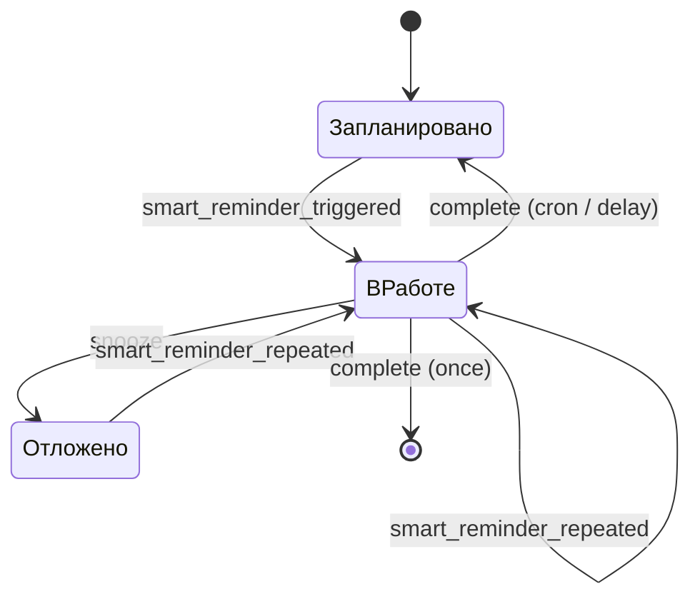

> 🇬🇧 [English version](README.md)

# Smart Reminder for Home Assistant

[](https://www.home-assistant.io/)
[](https://hacs.xyz/)
[](LICENSE)

**Smart Reminder** — локальная Custom Integration для Home Assistant, которая
добавляет управляемые напоминания с подтверждением выполнения, повторами,
мьютом, DnD и полноценной страницей в боковом меню.

Интеграция **не отправляет сообщения сама**. Она отвечает за надёжное
расписание и публикует события с готовыми текстом, получателями и параметрами
кнопок. Способ доставки выбираете вы: Telegram, мобильное приложение,
колонка, Mattermost или любая другая автоматизация Home Assistant.

## Возможности

- Создание, редактирование, дублирование, включение, удаление, перенос и завершение
  напоминаний из отдельной адаптивной страницы HA.
- Три режима: однократный, cron и задержка после фактического выполнения.
- Повторное событие через заданный интервал, пока напоминание не выполнено.
- Отдельные тексты для первого, повторного, отложенного и выполненного
  напоминания с предсказуемыми fallback-правилами.
- Глобальный DnD (по умолчанию `23:00–10:00`) и индивидуальный флаг его
  игнорирования.
- Точное расписание «раз в N недель» через расширение cron
  `@every Nw <crontab>`.
- Сохранение конфигурации и runtime-состояния в штатном HA `Store`.
- Обработка просроченных напоминаний после запуска Home Assistant.
- Отдельные sensor, switch и button-сущности для каждого напоминания.
- Actions и события для автоматизаций; внешних облачных сервисов нет.
- Русская и английская локализация config/options flow.

## Совместимость

- Home Assistant Core `2026.7.0` и новее в ветке `2026.7`.
- Текущая проверенная patch-версия: `2026.7.2`.
- Установка через HACS рекомендуется, ручная установка также поддерживается.

## Установка

### HACS (рекомендуется)

Репозиторий уже содержит `hacs.json` и подготовлен как HACS Integration.
До включения проекта в стандартный каталог HACS добавьте его как пользовательский:

1. Откройте **HACS → Integrations**.
2. В меню выберите **Custom repositories**.
3. Укажите URL этого GitHub-репозитория и категорию **Integration**.
4. Найдите **Smart Reminder**, установите последнюю версию и перезапустите HA.

### Вручную

1. Скопируйте каталог `custom_components/smart_reminder` в каталог конфигурации
   Home Assistant:

   ```text
   /config/custom_components/smart_reminder
   ```

2. Перезапустите Home Assistant.

Настройка через `configuration.yaml` не требуется.

## Первый запуск

1. Перейдите в **Настройки → Устройства и службы → Добавить интеграцию**.
2. Найдите **Smart Reminder**.
3. Подтвердите диапазон DnD. Время интерпретируется в часовом поясе Home
   Assistant.
4. После настройки в боковом меню появится страница **Smart Reminders**.

Чтобы изменить общие настройки позже, откройте карточку интеграции и нажмите
**Настроить**.

| Общая настройка | Значение по умолчанию |
|---|---|
| Начало DnD | `23:00` |
| Окончание DnD | `10:00` |
| Текст ошибки об уже отложенном напоминании | `⚠️ Ошибка. Напоминание уже отложено` |
| Текст ошибки об уже завершённом напоминании | `⚠️ Ошибка. Напоминание уже завершено` |

Если начало и окончание DnD совпадают, тихий период отключён. Пустые тексты
ошибок автоматически заменяются значениями по умолчанию.

## Поля напоминания

| Поле | Описание |
|---|---|
| ID | Стабильный ID длиной до 64 символов. Допустимы латинские буквы, цифры, `.`, `_`, `-`. Ограничение делает ID безопасным для Telegram callback-команд. |
| Название | Человекочитаемое имя в UI и сущностях. |
| Включено | Выключенное напоминание хранится, но не срабатывает. При повторном включении просроченное время обрабатывается сразу с учётом DnD. |
| Тип | `once`, `cron` или `after_completion`. |
| Дата и время первого запуска | Показывается при создании `once` и `after_completion`, в часовом поясе HA. Формат: `ДД.ММ.ГГГГ`, `ЧЧ:ММ` (24 часа). |
| Дата и время следующего запуска | Показывается при редактировании существующего напоминания любого типа и доступно для изменения. Формат: `ДД.ММ.ГГГГ`, `ЧЧ:ММ` (24 часа). |
| Crontab | Стандартное выражение из 5 полей. |
| Якорная дата | Необязательная дата первого цикла для расписания `@every Nw`. Позволяет выбрать нужную фазу недель, например `27.07.2026`; должна совпадать с днём запуска базового cron. |
| Задержка после выполнения | Минуты до следующего запуска `after_completion`. |
| Игнорировать DnD | Разрешает этому напоминанию срабатывать в тихий период. |
| Частота до выполнения | Интервал между повторными событиями в минутах. |
| Мьют по умолчанию | Попадает в событие как минуты и строка (`1h30m`) для кнопки бота. |
| Первый текст | Используется в `smart_reminder_triggered`. |
| Повторный текст | Используется в `smart_reminder_repeated`; если пуст, берётся первый текст. |
| Текст отложенного напоминания | Передаётся в `smart_reminder_snoozed` непосредственно при нажатии «Отложить». Не используется в `smart_reminder_repeated`. |
| Текст выполнения | Передаётся в `smart_reminder_completed`; может быть пустым. |
| ID получателей | Произвольные строки. Доставка трактует их самостоятельно, например как Telegram chat ID. |

### Типы расписания

| Тип | После выполнения |
|---|---|
| Однократное | Напоминание и его сущности удаляются. |
| По расписанию | Рассчитывается ближайшее следующее время по cron. |
| С задержкой | Следующий запуск = фактическое время выполнения + заданное количество минут. |

Стандартный crontab не умеет выразить «каждые две недели». Для этого
поддерживается обратно совместимое расширение:

```text
@every 2w 0 10 * * 1
```

Оно означает: взять cron «каждый понедельник в 10:00», но использовать только
каждую вторую неделю. Поле **Якорная дата** выбирает фазу расписания: при якоре
`27.07.2026` запуски будут `27.07`, `10.08`, `24.08` и так далее. Если поле
пустое, якорем автоматически становится ближайший запуск. Якорь сохраняется
вместе с напоминанием, поэтому расписание не сбивается после перезапуска и
учитывает DST часового пояса HA.

### Два примера из реальной жизни

**Полить кактус раз в две недели по понедельникам в 10:00:**

- тип: **По расписанию**;
- cron: `@every 2w 0 10 * * 1`;
- якорная дата: `27.07.2026`;
- частота до выполнения: например, `60` минут.

**Заменить воду коту через сутки после последней замены:**

- тип: **С задержкой после выполнения**;
- дата и время: первый запуск;
- задержка: `1440` минут.

## Жизненный цикл



DnD не отбрасывает событие: ближайшее срабатывание переносится на окончание
тихого периода. После офлайна HA обрабатывает каждое просроченное напоминание
один раз после `Home Assistant started`; пропущенные повторы одного и того же
напоминания объединяются, чтобы не создавать шторм уведомлений.

## Сущности Home Assistant

Для каждого напоминания динамически создаются четыре сущности:

| Платформа | Имя | Назначение |
|---|---|---|
| `sensor` | `<название> status` | Состояние `scheduled`, `active` или `snoozed`; атрибуты содержат ID, тип, следующий запуск, cron-якорь, получателей и интервалы. |
| `switch` | `<название> enabled` | Включение и отключение напоминания. |
| `button` | `<название> snooze` | Мьют на время по умолчанию. |
| `button` | `<название> complete` | Завершение напоминания. |

Все сущности объединены в виртуальное устройство **Smart Reminder**. Конкретный
`entity_id` создаёт Home Assistant из названия, поэтому для автоматизаций лучше
выбирать сущность через UI или использовать стабильный атрибут `reminder_id`.

## События

| Event type | Когда публикуется |
|---|---|
| `smart_reminder_triggered` | Первое срабатывание; статус уже `active`. |
| `smart_reminder_repeated` | Повтор до выполнения или срабатывание после snooze. Поле `text` всегда берётся из текста повторных напоминаний; если он пуст, используется текст первого напоминания. |
| `smart_reminder_snoozed` | Результат попытки отложить. При успехе `text` содержит текст отложенного напоминания; при повторном snooze — настроенный общий текст ошибки. |
| `smart_reminder_completed` | Результат попытки завершить. Публикуется и для однократного напоминания, которое к этому моменту уже удалено. Для recurring уже рассчитан следующий запуск. При повторном complete содержит настроенный общий текст ошибки. |

Основной контракт данных:

```yaml
reminder_id: take_out_trash
name: Выбросить мусор
reminder_type: once
status: active
text: Выбросить мусор
recipient_ids:
  - "<telegram_chat_id>"
ignore_dnd: false
default_snooze_minutes: 90
default_snooze_duration: 1h30m
repeat_count: 0
occurred_at: "2026-07-14T19:00:00+00:00"
scheduled_for: "2026-07-14T19:00:00+00:00"
next_trigger: "2026-07-14T19:15:00+00:00"
cron_anchor: null
```

В событиях `smart_reminder_snoozed` и `smart_reminder_completed` поле
`next_trigger` всегда присутствует. Оно содержит ISO 8601-время следующего
запуска либо `null`, если однократное напоминание завершено и удалено.
Дополнительно оба события содержат `action_succeeded` (`true`/`false`) и
`reason`: `already_snoozed`, `already_completed` либо `null`. У
`smart_reminder_snoozed` также есть `duration` и `snoozed_until`.

Пример вывода `next_trigger` в часовом поясе Home Assistant в формате
`ДД.ММ.ГГГГ ЧЧ:ММ`:

```yaml
formatted_next_trigger: >-
  
  {{ as_timestamp(value) | timestamp_custom('%d.%m.%Y %H:%M', true)
     if value else 'Следующего запуска нет' }}
```

В шаблонах HA минуты задаются как `%M` (аналог `ii` из некоторых других
форматов даты).

Поля `text` в событиях `smart_reminder_snoozed` и
`smart_reminder_completed` могут быть пустыми строками, но сами события всё
равно публикуются. Это позволяет автоматизации подставить стандартный шаблон.
При повторном snooze или complete поле `text` уже содержит непустой общий текст
ошибки. Повторное действие не изменяет статус, `next_trigger` и расписание.

`smart_reminder_snoozed` публикуется непосредственно при выполнении action
откладывания. Когда заданная задержка заканчивается, планировщик публикует уже
`smart_reminder_repeated`, использует текст повторных напоминаний и переводит
напоминание из `snoozed` в `active`.

## Управление в интерфейсе

Кнопка **Дублировать** открывает форму создания, заполненную данными выбранного
напоминания. Для копии генерируется новый ID, а runtime-состояние исходного
напоминания не копируется. Для `once` и `after_completion` ближайший запуск
исходного напоминания подставляется как первый запуск копии. Сохранение создаёт
отдельное напоминание и не изменяет оригинал.

## Actions

### `smart_reminder.create`

Создаёт упрощённое однократное напоминание. `reminder_id` и `name`
необязательны. Если action вызван с `response_variable`, возвращает созданный ID.

```yaml
action: smart_reminder.create
data:
  reminder_id: take_out_trash
  name: Выбросить мусор
  at: "2026-07-14 22:00:00"
  text: Выбросить мусор
  recipient_ids:
    - "<telegram_chat_id>"
  ignore_dnd: false
  repeat_interval_minutes: 15
  default_snooze_minutes: 90
response_variable: created_reminder
```

### `smart_reminder.snooze`

Формат длительности — комбинация дней, часов и минут без пробелов:
`15m`, `1h30m`, `2d3h15m`.

```yaml
action: smart_reminder.snooze
data:
  reminder_id: take_out_trash
  duration: 1h30m
```

Если напоминание уже имеет статус `snoozed`, повторный action не переносит его
ещё раз, а публикует `smart_reminder_snoozed` с `action_succeeded: false`.

### `smart_reminder.complete`

```yaml
action: smart_reminder.complete
data:
  reminder_id: take_out_trash
```

Если recurring-напоминание уже завершено и запланирован его следующий цикл,
повторный action не рассчитывает запуск заново, а публикует
`smart_reminder_completed` с `action_succeeded: false`. Однократное напоминание
после успешного завершения удаляется, поэтому его повторный вызов возвращает
ошибку «не найдено» и не может опубликовать второе событие.

## Полный пример с Telegram Bot

Пример рассчитан на актуальную UI-интеграцию
[Telegram bot](https://www.home-assistant.io/integrations/telegram_bot) в HA
2026.7. Она публикует команды и callback-кнопки через event-сущность. Во всех
примерах замените `event.my_telegram_bot` на event-сущность своего бота. Если
настроено несколько ботов, добавьте `config_entry_id` в actions
`telegram_bot.*`.

### 1. Обработка событий Smart Reminder

Автоматизация доставляет первое и повторное напоминания с inline-кнопками, а
также подтверждения выполнения и откладывания. Значения `recipient_ids`
интерпретируются как Telegram chat ID.

```yaml
alias: Smart Reminder. Обработка событий приложения
triggers:
  - trigger: event
    event_type: smart_reminder_triggered
    id: triggered
  - trigger: event
    event_type: smart_reminder_repeated
    id: repeated
  - trigger: event
    event_type: smart_reminder_completed
    id: completed
  - trigger: event
    event_type: smart_reminder_snoozed
    id: snoozed
conditions:
  - condition: template
    value_template: >-
      {{ trigger.event.data.recipient_ids
         | default([], true)
         | count > 0 }}
actions:
  - variables:
      reminder: "{{ trigger.event.data }}"
  - choose:
      - conditions:
          - condition: template
            value_template: "{{ trigger.id in ['triggered', 'repeated'] }}"
        sequence:
          - action: telegram_bot.send_message
            data:
              chat_id: "{{ reminder.recipient_ids | map('int') | list }}"
              parse_mode: plain_text
              message: "{{ reminder.text }}"
              inline_keyboard:
                - >-
                  ✅ Готово:/reminder_done:{{ reminder.reminder_id }},
                  🔕 Отложить:/reminder_snooze:{{ reminder.reminder_id }}:{{
                  reminder.default_snooze_duration }}
      - conditions:
          - condition: template
            value_template: "{{ trigger.id == 'completed' }}"
        sequence:
          - variables:
              completed_text: >-
                {{ reminder.text | default('') | string | trim }}
              formatted_next_trigger: >-
                
                {{ as_timestamp(value)
                   | timestamp_custom('%d.%m.%Y %H:%M', true)
                   if value else 'Следующего запуска нет' }}
          - action: telegram_bot.send_message
            data:
              chat_id: "{{ reminder.recipient_ids | map('int') | list }}"
              parse_mode: plain_text
              message: >-
                {{ completed_text
                   if completed_text
                   else '✅ Напоминание выполнено' }}.
                Следующий запуск: {{ formatted_next_trigger }}
      - conditions:
          - condition: template
            value_template: "{{ trigger.id == 'snoozed' }}"
        sequence:
          - variables:
              snoozed_text: >-
                {{ reminder.text | default('') | string | trim }}
              formatted_next_trigger: >-
                
                {{ as_timestamp(value)
                   | timestamp_custom('%d.%m.%Y %H:%M', true)
                   if value else 'Следующего запуска нет' }}
          - action: telegram_bot.send_message
            data:
              chat_id: "{{ reminder.recipient_ids | map('int') | list }}"
              parse_mode: plain_text
              message: >-
                {{ snoozed_text
                   if snoozed_text
                   else '🔕 Напоминание отложено' }}.
                Следующий запуск: {{ formatted_next_trigger }}
mode: queued
max: 20
```

### 2. Обработка inline-кнопок Telegram

Callback data использует разделитель `:` и совпадает с командами из первой
автоматизации.

```yaml
alias: Smart Reminder. Обработка кнопок Telegram
description: ""
triggers:
  - trigger: state
    entity_id:
      - event.my_telegram_bot
conditions:
  - condition: template
    value_template: >-
      
      
      {{ event_type == 'telegram_callback'
         and (data.startswith('/reminder_done:')
              or data.startswith('/reminder_snooze:')) }}
actions:
  - variables:
      callback:
        id: >-
          {{ trigger.to_state.attributes.id
             | default('', true)
             | string }}
        data: >-
          {{ trigger.to_state.attributes.data
             | default('', true)
             | string
             | trim }}
  - variables:
      callback_parts: "{{ callback.data.split(':', 2) }}"
  - variables:
      command: >-
        {{ callback_parts[0]
           if callback_parts | count > 0
           else '' }}
      reminder_id: >-
        {{ callback_parts[1] | trim
           if callback_parts | count > 1
           else '' }}
      duration: >-
        {{ callback_parts[2] | trim
           if callback_parts | count > 2
           else '' }}
  - choose:
      - conditions:
          - condition: template
            value_template: >-
              {{ command == '/reminder_done' and reminder_id != '' }}
        sequence:
          - action: smart_reminder.complete
            data:
              reminder_id: "{{ reminder_id }}"
          - action: telegram_bot.answer_callback_query
            data:
              callback_query_id: "{{ callback.id }}"
              message: ✅ Напоминание выполнено
              show_alert: false
      - conditions:
          - condition: template
            value_template: >-
              {{ command == '/reminder_snooze'
                 and reminder_id != ''
                 and duration != '' }}
        sequence:
          - action: smart_reminder.snooze
            data:
              reminder_id: "{{ reminder_id }}"
              duration: "{{ duration }}"
          - action: telegram_bot.answer_callback_query
            data:
              callback_query_id: "{{ callback.id }}"
              message: "🔕 Отложено на {{ duration }}"
              show_alert: false
    default:
      - action: telegram_bot.answer_callback_query
        data:
          callback_query_id: "{{ callback.id }}"
          message: ⚠️ Некорректные данные кнопки
          show_alert: true
mode: parallel
max: 20
```

### 3. Добавление напоминания командой `/reminder_add`

Поддерживаются оба формата. Если дата пропущена, используется текущая дата в
часовом поясе Home Assistant.

```text
/reminder_add 14.07.2026 22:00 Выбросить мусор
/reminder_add 22:00 Выбросить мусор
```

```yaml
alias: Telegram Commands. Добавить напоминание
description: ""
triggers:
  - trigger: state
    entity_id:
      - event.my_telegram_bot
conditions:
  - condition: state
    entity_id: event.my_telegram_bot
    state:
      - telegram_command
    attribute: event_type
  - condition: state
    entity_id: event.my_telegram_bot
    attribute: command
    state: /reminder_add
actions:
  - variables:
      raw_args: >-
        {{ trigger.to_state.attributes.args | default([], true) }}
  - variables:
      tokens: >-
        {{ raw_args.strip().split()
           if raw_args is string
           else (raw_args | list) }}
  - variables:
      has_date: >-
        {{ tokens | count > 0
           and (tokens[0]
                | regex_match(
                    '^[0-9]{2}[.][0-9]{2}[.][0-9]{4}$')) }}
  - variables:
      date_token: >-
        {{ tokens[0] if has_date else now().strftime('%d.%m.%Y') }}
      time_token: >-
        
          {{ tokens[1] }}
        
          {{ tokens[0] }}
        
          {{ '' }}
        
      text_tokens: >-
        {{ tokens[2:] if has_date else tokens[1:] }}
  - variables:
      reminder_text: "{{ text_tokens | join(' ') | trim }}"
      reminder_at: >-
        {% set parsed = strptime(
          date_token ~ ' ' ~ time_token,
          '%d.%m.%Y %H:%M',
          none) %}
        {{ parsed.strftime('%Y-%m-%dT%H:%M:%S')
           if parsed is not none
           else '' }}
  - variables:
      valid_input: >-
        {{ (date_token
             | regex_match(
                 '^[0-9]{2}[.][0-9]{2}[.][0-9]{4}$'))
           and (time_token
                | regex_match(
                    '^(?:[01][0-9]|2[0-3]):[0-5][0-9]$'))
           and reminder_at != ''
           and reminder_text != '' }}
  - choose:
      - conditions:
          - condition: template
            value_template: "{{ valid_input }}"
        sequence:
          - action: smart_reminder.create
            data:
              at: "{{ reminder_at }}"
              name: "{{ reminder_text }}"
              text: "{{ reminder_text }}"
              recipient_ids:
                - "{{ trigger.to_state.attributes.chat_id }}"
              repeat_interval_minutes: 15
              default_snooze_minutes: 30
            response_variable: created_reminder
          - action: telegram_bot.send_message
            data:
              chat_id: "{{ trigger.to_state.attributes.chat_id }}"
              parse_mode: plain_text
              message: |-
                🔔 Напоминание создано на {{ date_token }} в {{ time_token }}.
                ID: {{ created_reminder.reminder_id }}
    default:
      - action: telegram_bot.send_message
        data:
          chat_id: "{{ trigger.to_state.attributes.chat_id }}"
          parse_mode: plain_text
          message: |-
            ⚠️ Не удалось создать напоминание.

            Используйте один из форматов:
            /reminder_add ДД.ММ.ГГГГ ЧЧ:ММ текст
            /reminder_add ЧЧ:ММ текст

            Например:
            /reminder_add 14.07.2026 22:00 Выбросить мусор
            /reminder_add 22:00 Выбросить мусор
mode: queued
max: 5
```

Telegram ограничивает callback data 64 байтами. Поэтому используйте короткие
ASCII ID напоминаний, если создаёте их вручную.

## Хранение и надёжность

Данные сохраняются после каждого изменения в `.storage` через штатный
`homeassistant.helpers.storage.Store`. Не редактируйте файл вручную. Хранятся
не только настройки, но и статус, следующий запуск, последняя активация,
последнее выполнение и якорь многонедельного cron.

Событие публикуется только после сохранения нового состояния. Автоматизация,
которая сразу читает sensor, увидит уже актуальные `active`, `snoozed` или
следующее запланированное время. Исключение — выполненное однократное
напоминание: оно удаляется вместе со своими сущностями, а все нужные данные
остаются в payload события `smart_reminder_completed`.

## Безопасность

- Страница и изменяющие WebSocket-команды доступны только администраторам HA.
- Интеграция не открывает внешних endpoint и не делает сетевых запросов.
- ID получателей считаются непрозрачными строками и нигде не используются до
  передачи в событие.
- Тексты экранируются перед выводом в таблице панели.

## Разработка

Целевая версия HA 2026.7 использует Python 3.14. Локальные проверки:

```bash
python3.14 -m pip install -r requirements_test.txt
ruff check .
ruff format --check .
pytest
```

CI также запускает HACS validation. Backend полностью асинхронный; на всё
множество напоминаний используется только один ближайший таймер.

## Диагностика

- **Страница не появилась:** убедитесь, что интеграция не только установлена,
  но и добавлена в **Настройки → Устройства и службы**, затем обновите страницу
  браузера.
- **Напоминание не сработало ночью:** проверьте DnD и флаг
  **Игнорировать DnD**.
- **Telegram не получает событие:** проверьте прослушивание
  `smart_reminder_triggered` в Developer Tools и правильность `recipient_ids`.
- **Cron запускается не в то время:** cron вычисляется в часовом поясе,
  выбранном в общих настройках Home Assistant. Для `@every Nw` также проверьте
  якорную дату: она задаёт фазу многонедельного цикла.
- **После офлайна пришло одно, а не много сообщений:** пропущенные повторы одного
  напоминания намеренно объединяются в одно актуальное событие.

## Лицензия

[MIT](LICENSE)
